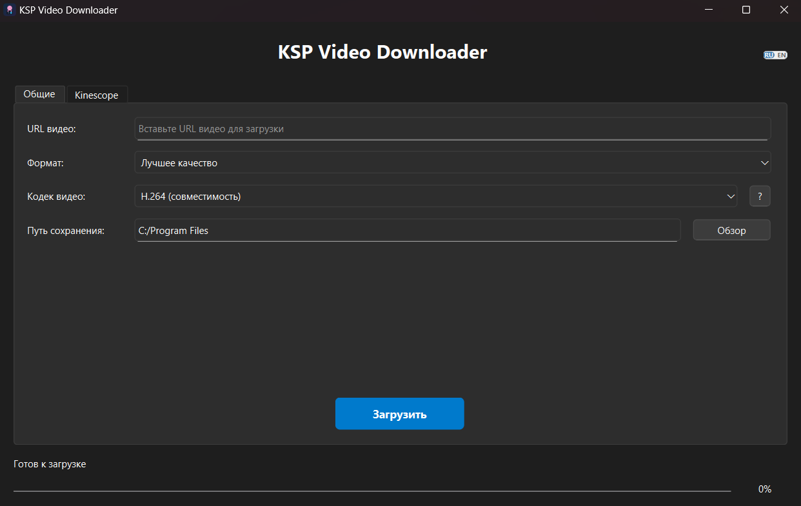
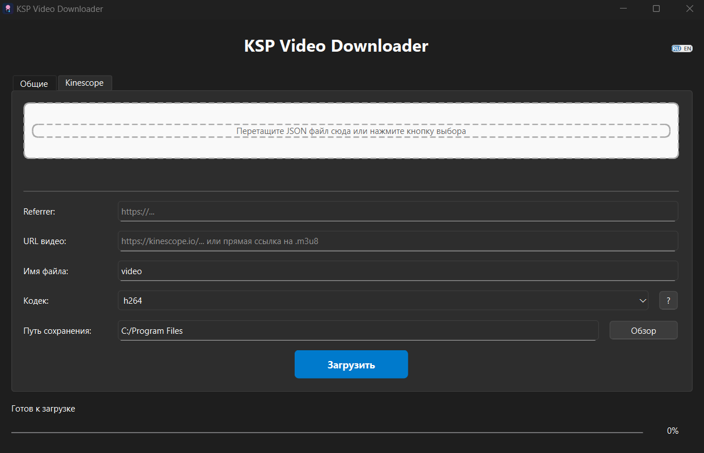

<div align="center">
  
  
  # KSP Video Downloader
  
  **Мощный и удобный загрузчик видео с современным интерфейсом**
  
  *Скачивайте видео с любых платформ одним кликом, включая специальную поддержку Kinescope*
  
  
  
  
  
</div>

---

## 🎯 Что это такое?

KSP Video Downloader — это современное десктопное приложение для загрузки видео с различных платформ. Приложение сочетает в себе мощь библиотеки yt-dlp с интуитивно понятным графическим интерфейсом на PySide6.

**Особенность:** Приложение включает специализированный функционал для загрузки видео с платформы **Kinescope** с поддержкой JSON-конфигураций и настраиваемых referrer-заголовков.

## 📸 Демонстрация



*Главное окно приложения с интуитивно понятным интерфейсом для загрузки видео. Поддерживает вставку URL, выбор качества и формата, а также отображает прогресс загрузки в реальном времени.*



*Специализированный интерфейс для загрузки видео с Kinescope, включающий поддержку JSON-конфигураций и настройку referrer-заголовков для обхода ограничений доступа.*


## ✨ Основные возможности

### 🌐 Универсальная загрузка
- **Поддержка 1000+ сайтов** благодаря интеграции с yt-dlp
- **Множественные форматы**: MP4, MKV, AVI, MP3, M4A
- **Выбор качества**: от 360p до 4K, включая "лучшее доступное"
- **Только аудио**: извлечение аудиодорожки в высоком качестве

### 🎬 Специальная поддержка Kinescope
- **Прямая загрузка** с платформы Kinescope
- **JSON-конфигурации**: загрузка через файлы конфигурации
- **Настраиваемые referrer**: обход ограничений доступа
- **Drag & Drop**: простое перетаскивание JSON-файлов
- **Выбор кодека**: H.264 или AV1

### 🖥️ Современный интерфейс
- **Интуитивный GUI** на базе PySide6
- **Многоязычность**: русский и английский интерфейсы
- **Прогресс в реальном времени**: скорость, ETA, процент выполнения
- **Удобная навигация**: вкладочный интерфейс для разных режимов

## 🚀 Быстрый старт

### Системные требования
- **ОС**: Windows 11 (протестировано)
- **Python**: 3.8 или выше
- **Свободное место**: минимум 100 МБ

### Установка

1. **Клонируйте репозиторий:**
   ```bash
   git clone https://github.com/yourusername/ksp_video_download.git
   cd ksp_video_download
   ```

2. **Установите зависимости:**
   ```bash
   pip install -r requirements.txt
   ```

3. **Запустите приложение:**
   ```bash
   python src/main.py
   ```

## 📖 Использование

### Обычная загрузка
1. Вставьте URL видео в поле "Video URL"
2. Выберите желаемое качество и формат
3. Укажите папку для сохранения
4. Нажмите "Download"

*[Здесь должен быть скриншот процесса обычной загрузки]*

### Загрузка с Kinescope
1. Перейдите на вкладку "Kinescope"
2. **Ручной ввод**: введите URL, referrer и имя файла
3. **Или загрузите JSON**: перетащите файл конфигурации
4. Выберите кодек и папку сохранения
5. Начните загрузку

*[Здесь должен быть скриншот интерфейса Kinescope]*

### Пример JSON для Kinescope
```json
{
  "referrer": "https://kinescope.io/embed/123456789",
  "video_data": {
    "title": "Название видео",
    "formats": {
      "hls": {
        "url": "https://example.com/video/playlist.m3u8",
        "quality": "1080p"
      }
    }
  }
}
```

## 🎨 Почему выбрать KSP Video Downloader?

| Особенность | KSP Video Downloader | Другие решения |
|-------------|---------------------|----------------|
| **Kinescope поддержка** | ✅ Встроенная | ❌ Отсутствует |
| **Современный GUI** | ✅ PySide6 | ❌ Консоль/устаревший |
| **Многоязычность** | ✅ RU/EN | ❌ Только EN |
| **JSON конфигурации** | ✅ Drag & Drop | ❌ Ручная настройка |
| **Прогресс загрузки** | ✅ Реальное время | ❌ Базовый |

## 🛠️ Для разработчиков

### Структура проекта
```
ksp_video_download/
├── src/
│   ├── core/          # Ядро приложения
│   ├── ui/            # Пользовательский интерфейс
│   └── main.py        # Точка входа
├── resources/         # Ресурсы (иконки, локализация)
├── tests/            # Тесты
└── docs/             # Документация
```

### Запуск тестов
```bash
python run_tests.py
```

### Сборка исполняемого файла
```bash
python build.py
```

## 🐛 Сообщить об ошибке

Если вы обнаружили ошибку или у вас есть предложения по улучшению:

1. **Проверьте** [существующие issues](https://github.com/yourusername/ksp_video_download/issues)
2. **Создайте новый issue** с подробным описанием
3. **Укажите** версию Windows и Python
4. **Приложите** логи из папки `logs/` (если есть)

**Протестировано на:** Windows 11

## 🤝 Вклад в проект

Мы приветствуем вклад в развитие проекта! Вы можете:

- 🐛 Сообщать об ошибках
- 💡 Предлагать новые функции
- 🌍 Помочь с переводом на другие языки
- 📝 Улучшать документацию
- 💻 Отправлять Pull Request'ы

## 🚀 Планы на будущее

Мы постоянно работаем над улучшением KSP Video Downloader! Вот некоторые из наших планов:

-   **Расширение функционала**: Добавление новых возможностей для загрузки видео и управления ими.
-   **Поддержка других платформ**: Адаптация приложения для macOS и Linux.
-   **Улучшение производительности**: Оптимизация скорости загрузки и работы интерфейса.
-   **Исправление ошибок**: Регулярное устранение найденных багов и улучшение стабильности.
-   **Новые языки**: Добавление поддержки других языков.

Мы всегда открыты для ваших предложений и идей!

## 📞 Поддержка

- **GitHub Issues**: [Создать issue](https://github.com/yourusername/ksp_video_download/issues)

---

<div align="center">
  <p>Сделано с ❤️ для удобной загрузки видео</p>
  <p>⭐ Поставьте звезду, если проект оказался полезным!</p>
</div>